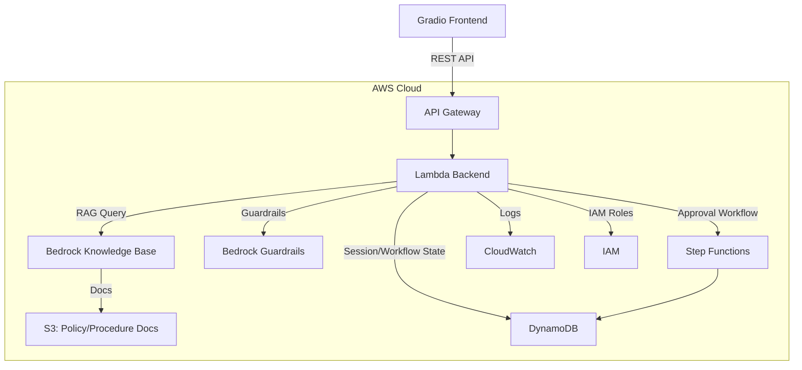

# AI Clinical Support Copilot (HIPAA-Aware Architecture)

## Project Overview

The AI Clinical Support Copilot is designed to streamline healthcare operations by providing staff with an intelligent assistant that answers policy questions, summarizes intake information, and routes administrative actions through secure approval workflows. Built with AWS-native services and a HIPAA-aware architecture, the project demonstrates how AI can be safely integrated into regulated healthcare environments to improve efficiency, consistency, and auditability.

## Problem Statement

Healthcare operations teams face increasing administrative burdens, from answering complex policy questions to managing intake and routing sensitive actions for approval. Manual processes are time-consuming, error-prone, and can lead to inconsistent outcomes. There is a need for a secure, privacy-conscious assistant that can provide grounded answers, automate routine tasks, and ensure sensitive actions are handled with proper oversight—without risking patient privacy or regulatory compliance.

## Architecture Notes

- The solution uses AWS services to ensure scalability, security, and compliance.
- Gradio provides a rapid prototyping frontend for staff interaction.
- API Gateway and Lambda orchestrate chat, retrieval, and workflow logic.
- Amazon Bedrock powers the AI layer, with Knowledge Base for RAG over policy documents and Guardrails for domain constraints.
- S3 stores policy and procedure documents; DynamoDB manages session and workflow state.
- Step Functions handle approval workflows, ensuring human-in-the-loop for sensitive actions.
- CloudWatch and IAM provide observability and least-privilege security.
- The architecture is designed to avoid unnecessary PHI storage and to log only metadata, supporting HIPAA principles.

---

## What it does

- Answers clinic policy and procedure questions
- Provides grounded responses from approved internal documents
- Summarizes intake information from structured input
- Drafts administrative follow-up actions
- Routes sensitive actions into an approval workflow

## What it does **not** do

- Diagnose patients
- Recommend treatment
- Replace clinicians
- Act on PHI with no controls

> **Disclaimer:** This project is a HIPAA-aware educational architecture prototype and is not a production-certified healthcare system.

---

## Core Use Case

Build a clinical operations assistant for:
- Front desk staff
- Operations staff
- Care coordinators
- Intake/admin teams

**Example Supported Tasks:**
- “What forms are required for a new patient intake?”
- “Summarize this intake note for staff review.”
- “What is the follow-up process after discharge?”
- “Draft a callback request for this patient.”
- “Start a prior-authorization follow-up request.”

---

## Architecture Overview

### Frontend
- Gradio (for rapid prototyping and UI)

### Backend
- API Gateway (REST endpoint)
- Lambda (chat and workflow orchestration)

### AI Layer
- Amazon Bedrock (LLM)
- Bedrock Knowledge Base (RAG over policy docs)
- Bedrock Guardrails (domain constraints)

### Data/Storage
- S3 (policy/procedure documents)
- DynamoDB (sessions, intake summaries, workflow state)

### Workflow
- Step Functions (approval/review flow)

### Observability/Security
- CloudWatch (logging, monitoring)
- IAM (least-privilege access)
- IAM roles implemented for limited access to AWS resources

---

## 2-Week Build Plan

### Week 1: Build the MVP
1. Define use case, repo structure, and architecture
2. Prepare realistic healthcare documents and sample data (fake only)
3. Set up S3 + Bedrock Knowledge Base
4. Build Lambda for chat and retrieval orchestration
5. Add API Gateway endpoint
6. Build Gradio UI
7. Add DynamoDB for sessions and intake summaries

**Milestone:** End-to-end MVP with Gradio frontend, API Gateway, Lambda backend, Bedrock Knowledge Base, S3, and DynamoDB.

### Week 2: Regulated-Industry Features
8. Add Bedrock Guardrails (no diagnosis/treatment, admin-only)
9. Add prompt rules and structured templates
10. Add Step Functions approval workflow
11. Add CloudWatch logging and error handling
12. Add HIPAA-aware design decisions and documentation
13. Polish README, add architecture diagram, screenshots, and rationale
14. Record demo video and create LinkedIn content

---

## Build Progress

### ✅ Completed
- **Day 1-2:** Architecture and project planning
- **Day 3:** S3 bucket setup, healthcare documents uploaded, Bedrock Knowledge Base configured
  - S3 bucket created with encryption and versioning (`my-hipaa-copilot-docs-brandonreed-2026`)
  - 9 sample healthcare documents uploaded (policies, procedures, intake forms, checklists)
  - Bedrock Knowledge Base (ID: HHLBESSDCF) successfully configured and synced
  - RAG retrieval validated with sample queries:
    - ✓ "What documents are required for a new patient?" → Returns accurate intake requirements
    - ✓ "What is the callback escalation workflow?" → Returns detailed escalation procedure
    - ✓ "What should staff do after discharge follow-up is missed?" → Returns proper escalation steps
  - All answers grounded in source documents with proper citations

### 🔄 Next Steps
- **Day 4+:** Lambda backend, API Gateway, DynamoDB, Gradio UI, Bedrock Guardrails, Step Functions

---

## Why this matters in healthcare

- Reduces staff burnout and admin overload
- Provides consistent, policy-grounded answers
- Improves workflow efficiency and auditability
- Demonstrates realistic, privacy-conscious AI in a regulated setting

---

## Why I chose these AWS services

- **Bedrock:** Managed foundation model access
- **Knowledge Base:** RAG over policy documents
- **Guardrails:** Domain constraints and safety
- **Lambda:** Serverless orchestration
- **API Gateway:** Clean external API
- **DynamoDB:** Session/workflow state
- **Step Functions:** Approval flows
- **CloudWatch:** Auditability and debugging
- **S3:** Document storage

---

## AWS Service Coverage Analysis

### ✅ Currently Leveraging
| Service | Category | Usage |
|---------|----------|-------|
| **Lambda** | Compute & Orchestration | Serverless backend orchestration |
| **Step Functions** | Compute & Orchestration | Approval workflows |
| **S3** | Storage | Policy/procedure document storage |
| **DynamoDB** | Database | Session and workflow state management |
| **API Gateway** | Networking & Traffic | REST endpoint for frontend communication |
| **IAM** | Security & Access | Least-privilege roles and access control |
| **Amazon Bedrock** | AI/Machine Learning | Foundation models for chat and reasoning |
| **Bedrock Knowledge Base** | AI/Machine Learning | RAG (Retrieval-Augmented Generation) over policy docs |
| **Bedrock Guardrails** | AI/Machine Learning | Domain constraints and safety guardrails |
| **CloudWatch** | Monitoring | Logging, monitoring, and auditability |

### 🧭 Planned Integrations (Phase 3)
| Service | Category | Planned Use | Trigger/Dependency |
|---------|----------|-------------|-------------------|
| **EC2** | Compute | Host long-running tasks or model adapters if Lambda limits are hit | Only if workloads exceed Lambda constraints |
| **VPC** | Networking | Private subnets, VPC endpoints, and tighter network isolation | Required for regulated connectivity or private data sources |
| **RDS** | Database | Relational audit logs, reporting, and analytics | Introduced if relational queries become a requirement |
| **CloudFront** | Content Delivery | Global distribution for UI and static assets | Added when multi-region latency becomes a concern |
| **Route 53** | DNS | Custom domain management for production deployments | Added when a public domain is required |

### 📋 Core Technology Layers Covered
- ✅ **Networking:** API Gateway, networking via AWS services
- ✅ **Operating Systems:** Abstracted by Lambda and managed services
- ✅ **Virtualization:** Implicit in serverless compute
- ✅ **Databases:** DynamoDB for state; Bedrock Knowledge Base for document retrieval

### 🚀 Integration Notes
- These services are intentionally deferred until the MVP and agentic orchestration layer are validated.
- The roadmap will be updated once Phase 3 work is scheduled and scoped.

---

## Security Considerations

- Least-privilege IAM roles
- Avoid unnecessary PHI storage
- Use only fake data for demo
- Log metadata, not sensitive content
- Human review for sensitive workflows

---

## Future Improvements

- React frontend
- Django backend/service layer
- Cognito authentication
- Role-based dashboards
- More workflow integrations

---

## Demo & Screenshots

_Add screenshots and a link to your demo video here._

---

## Disclaimer

This project is a HIPAA-aware educational architecture prototype and is not a production-certified healthcare system. No real patient data is used. For demonstration purposes only.
### Architecture Diagram

