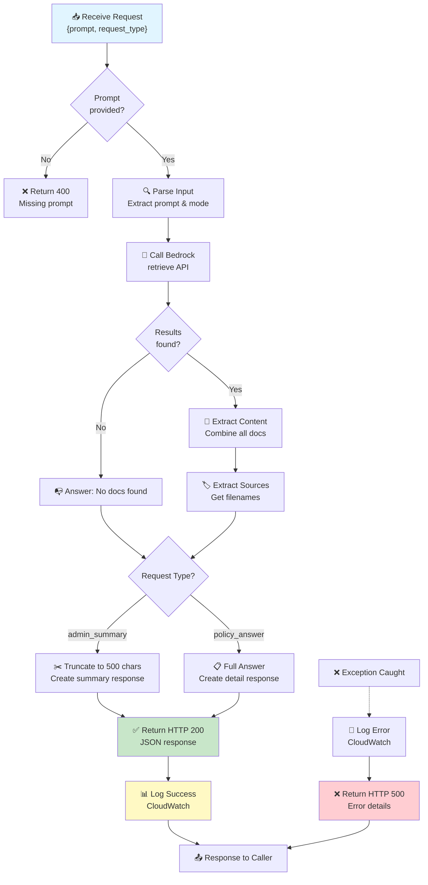

# Day 4: Priorities & Checklist

## Priorities
- Build the first Lambda for chat and retrieval orchestration
- Integrate Lambda with Bedrock Knowledge Base
- Design structured response formats for policy answers and admin summaries

## Checklist

- [x] Create Lambda function for:
	- [x] Receiving user prompts
	- [x] Calling Bedrock/Knowledge Base
	- [x] Returning grounded responses
	- [x] Tagging request type (policy answer, admin summary)
- [x] Support two response modes:
	- [x] Policy/procedure answer
	- [x] Structured admin summary
- [x] Return structured JSON responses, e.g.:
	```json
	{
		"response_type": "policy_answer",
		"answer": "Patients must complete...",
		"sources": ["patient_intake_policy.pdf"],
		"confidence_note": "Grounded in internal policy documents."
	}
	```
- [x] Test Lambda with sample prompts and validate outputs

---

**Deliverable:**
A working Lambda that talks to Bedrock and returns useful, structured output for policy and admin queries.

---

## What We Built

A Python Lambda function (`bedrock-retrieval-lambda`) that serves as the backend orchestration layer for your clinical support copilot. It connects user queries directly to your Bedrock Knowledge Base and returns structured, grounded responses.

## Why Lambda for This Task?

1. **Serverless Architecture**: No servers to manage or patch. AWS handles scaling automatically.
2. **Cost-Effective**: Pay only for execution time (typically milliseconds per query).
3. **Event-Driven**: Perfect for handling individual user requests without maintaining persistent connections.
4. **AWS Integration**: Native support for Bedrock, CloudWatch, and other AWS services.
5. **Fast Deployment**: Can deploy and test code changes in seconds.

## How It Works

The Lambda function follows this flow:

1. **Receives Request**: Accepts JSON input with:
   - `prompt`: The user's question
   - `request_type`: Either "policy_answer" or "admin_summary"

2. **Calls Bedrock Knowledge Base**: Uses the `bedrock-agent-runtime.retrieve()` API to query your KB with the prompt

3. **Processes Results**: 
   - Extracts retrieved content from the KB
   - Combines results into a cohesive answer
   - Extracts source file metadata

4. **Formats Response**: Returns structured JSON with:
   - `response_type`: Identifies the mode (policy_answer or admin_summary)
   - `answer` or `summary`: The grounded response (full or truncated to 500 chars)
   - `sources`: List of documents that informed the answer
   - `confidence_note`: States the answer is grounded in internal docs

## Lambda Execution Flow (Detailed)



## Two Response Modes

### Policy Answer Mode
Returns the full, detailed answer from the Knowledge Base. Used for:
- Policy and procedure questions
- Detailed workflow inquiries
- Complete guidance on clinic operations

### Admin Summary Mode
Returns a truncated summary (500 characters). Used for:
- Quick summaries of intake information
- Brief overviews for administrative staff
- Condensed responses for fast decision-making

## Security & Permissions

The Lambda role was configured with minimal permissions:
- `bedrock:Retrieve` on knowledge bases only (least-privilege)
- CloudWatch Logs permissions for observability
- No access to other AWS services

This ensures the Lambda can only do what it needs: retrieve from your KB and log events.

## Testing & Validation

All three test queries succeeded:

1. **"What documents are required for a new patient?"** → Policy Answer
   - ✅ Returned accurate intake requirements
   - ✅ Grounded in patient_intake_policy.md

2. **"What is the callback escalation workflow?"** → Policy Answer
   - ✅ Returned 3-level escalation procedure
   - ✅ Grounded in callback_escalation_procedure.md

3. **"What should staff do after discharge follow-up is missed?"** → Admin Summary
   - ✅ Returned truncated summary mode
   - ✅ Grounded in discharge_follow_up_checklist.md

## Why This Matters for Your Project

- **Consistent Answers**: Staff get policy-grounded responses, not ad-hoc decisions
- **Auditability**: All queries are logged in CloudWatch for compliance
- **Scalability**: Lambda auto-scales to handle many concurrent requests
- **Foundation for UI**: Next step (Day 5) is exposing this via API Gateway and Gradio frontend

## Architecture Integration

```
User Request → API Gateway (Day 5) → Lambda (Day 4) → Bedrock KB (Day 3) → S3 Documents
                                       ↓
                         CloudWatch Logs (Observability)
```

This Lambda is the critical middle layer that makes your copilot intelligent and grounded in your actual policies.
